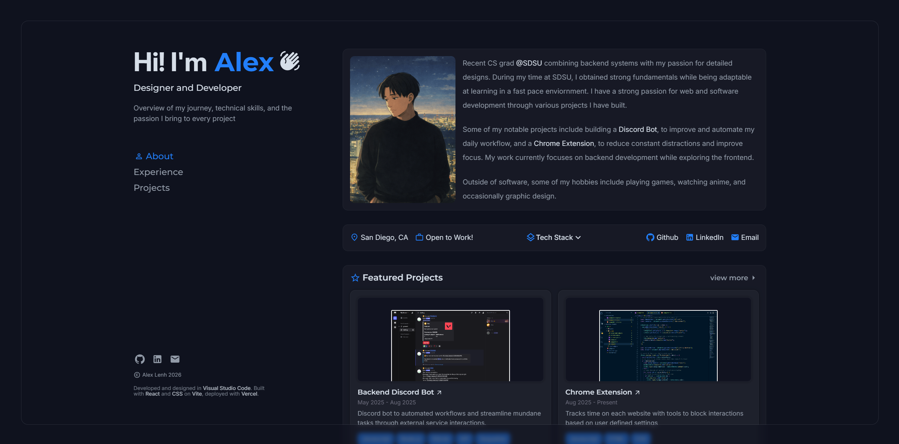

# alexlenh.com v1

The first and possibly last iteration of my personal portfolio. Designed to showcase projects and my journey in software development. Built with React and CSS on Vite and hosted with Vercel.

    
    
    <>

## Currently WIP

Always adding projects and adjusting / adding new features.

Things I might add in the future:

- Customizable color theme
- Backend for more interactions and customizability

# Inspiration

Some of the cool websites that inspired me:

- https://brittanychiang.com/
- https://p5aholic.me/
- https://jasoncameron.dev/
- https://tedawf.com/
